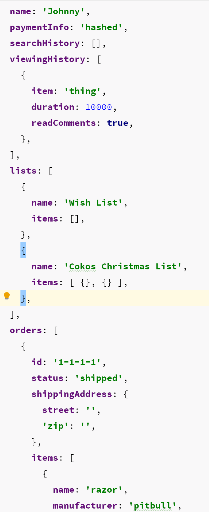
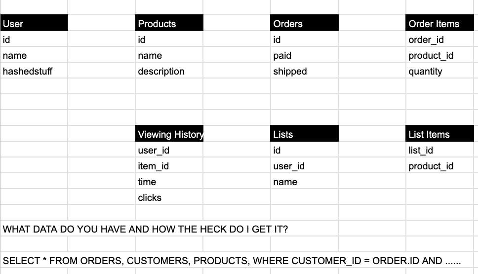

# Lecture Guide: Data Modeling

## TOPIC 1: Entity Data Modeling

- **Why** (5 min)
  - We need a way to fully describe real world entities
    - Beyond simply stating the "shape" of an object (Schema)
    - Beyond simply validating that shape (Validator libraries)
    - Modeling also describes behavior
      - Saving and Retrieving
      - Business Rules
  - It's highly scalable, repeatable and maintainable to have all of that "logic" in one place
- **What** (10 min)
  - "Models" are a part of MVC architecture
  - They describe shape (what properties does an object have)
  - They describe rules (what is required, data types, etc)
  - They adhere to basic behaviors (CRUD)
  - They can have business logic
  - Models generally represent entities (like a type of food)
  - Collections are generally an interface to a group of Models (i.e. a database/table)
- **How** (15 min)
  - Data modeling in Javascript
    - "The process of taking a real world or conceptual idea and encoding it into Javascript's built in data types."
    - Boolean values should be used when the data can have only two states.
    - Numbers should be used when the data could support arithmetic operations.
    - Strings should be used when the data is representing a natural language.
    - Arrays should be used to bundle multiple pieces of like data.
    - Objects should be used to bundle multiple pieces of different data.
    - What can a basic entity "do" (verb)
      - Start by asking "What does an entity (like a person) look like in code?"
        - Age: Number, Required
        - Name: String, Required
        - Pets: Array, Optional
        - ...
    - What is the output of modeling? **A Schema**
  - Modeling core behaviors
    - CRUD - Basic Data Operations
      - **CREATE** - Add a record to a data store
      - **READ** - Retrieve a record from a data store
      - **UPDATE** - Update a record within a data store
      - **DELETE**  - Remove a record from a data store
  - Use plenty of diagrams and loose coding examples as you describe the above topics
  - Diagram "food" as a data model
    - Introduce the notion of properties, rules, data types, allowed values
    - Behaviors and characteristics

## TOPIC 2: SQL Databases and Sequelize

- **Why** (5 min)
  - Standard language for relational data.
  - Let's define specific relationship types between models.
    - Does one model require the presence of another?
      - Ex: Does a `Message` come from a `User`?
  - Our Database has our back if we try and remove related data or create incomplete data.
- **What** (10 min)
  - Stores data in a "Record".
    - Resembles Tabular Data.
    - A new record is a new row in the table.
  - Relations are made by associating records with "keys".
  - There should be multiple tables that are seemingly disconnected.
    - Usage of keys and perhaps join tables will connect tables.
  - Compared to `MongoDB`, it can be hard to get a complete idea of all your application data.
    - Important to associate tables correctly.
    - Use diagrams to show how application entities rely on one another.
  - **SQL** offers a standardized and straight forward syntax for creating tables and manipulating records.
    - Show the students the `psql` setup, command line tooling
    - Discuss briefly how it stores data
      - Tables and Rows va Collections of Documents.
      - The students will work with Postgres data stores for the rest of the course.
        - The intricacies emerge as you go, so be "ok" with the "use and demo to teach" model over a long theoretical discussion of SQL databases.
    - `Postgres` server
      - start and stop it using the command line.
      - set it as a service.
      - dig in deep with the students that this is a separate server that can also run remotely
      - without it, no app can connect!
- **How** (30 min)
  - Do an interactive chart/drawing with your students on modeling out an e-commerce app with customers and orders tables to highlight differences
    - Create new tables for each type of data.
    - Connect related data and describe how the database might know if those tables are connected.
    - This same data (product info) might live in multiple records.
  - Lead the students in a differences and pros/cons discussion
  - Open the `psql` shell and demonstrate some basic commands
    - `\l` - list of databases
    - `\c <db>` - connect to a database
    - `\dt` - list all tables in the current database
    - `CREATE TABLE table_name (column1 datatype,column2 datatype);` - create a new table in the database and adds column names and datatypes.
    - `INSERT INTO table_name (column1_data, column2_data, column3_data);` - creates a new Row in a table with data for each column.
    - `SELECT column1, column2 FROM table_name;` - Get column data from a specific table.

### NoSQL Data Model

### Relational DB Model

## TOPIC 3: Collection Class (Code!)

- **Why** (5 min)
  - Database specific logic belongs in it's own module.
    - We want to be able to perform the same CRUD logic for every resource in our API.
    - A generic data operations class let's us keep things DRY.
  - Keeping database specific stuff out of the Router will be easier to maintain.
- **What** (10 min)
  - ES6 class that has a method for each CRUD operation.
    - read()
    - create()
    - update()
    - delete()
  - Each method can do all the specific things that our API might need to make persistent changes.
    - Are there optional parameters?
      - How do we handle these small changes at the data layer?
  - We can add helper methods for doing SQL specific things that really don't concern the Router.
    - Creating associated models.
    - Adding our own SQL associations.
- **How** (30 min)
  - Create a `Collection` class that consumes a `Sequelize` model.
  - Focus on the basic CRUD methods, which should call out to the encapsulated model.
    - Try to refactor the router from the previous day.
    - You should be able to copy and paste much of the route handler that modify to use `this.model`.
  - Create a One-To-Many relationship using the join-table outlined from earlier.
    - We can use the class to automatically create associations if the method specifies that another record should be associated.
  - Run an interactive demo (TDD), creating a Class and for each CRUD method write a test asserting proper data is returned.
