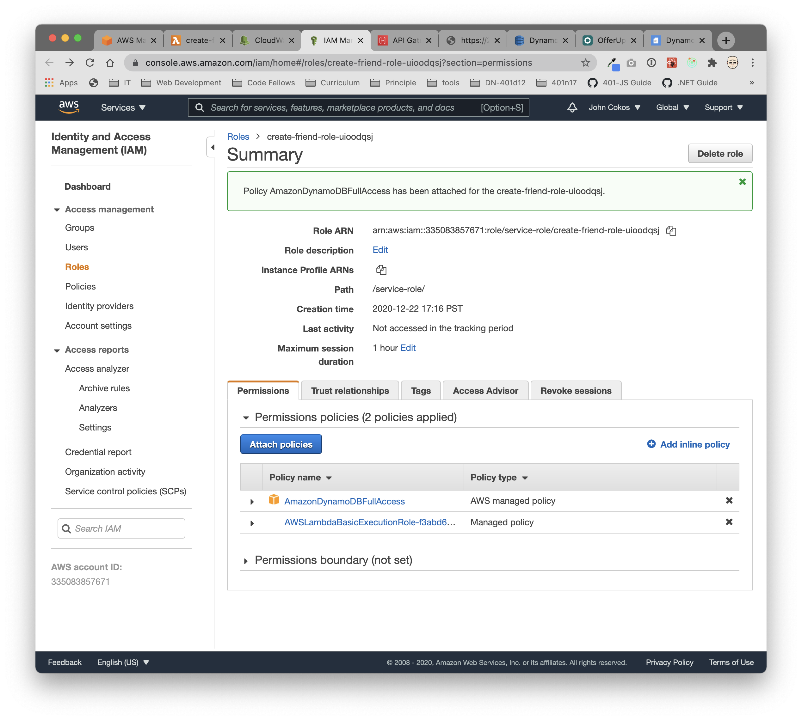
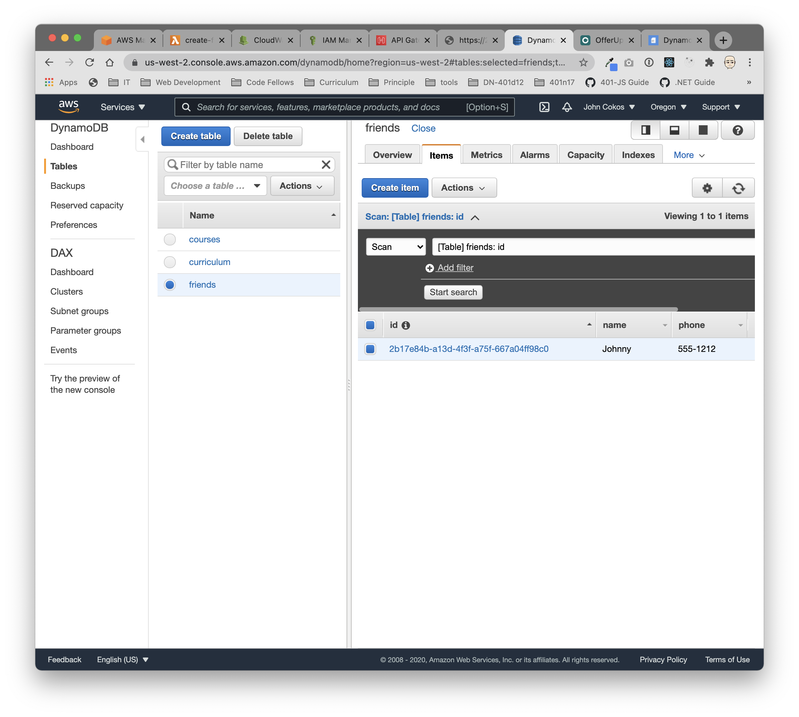
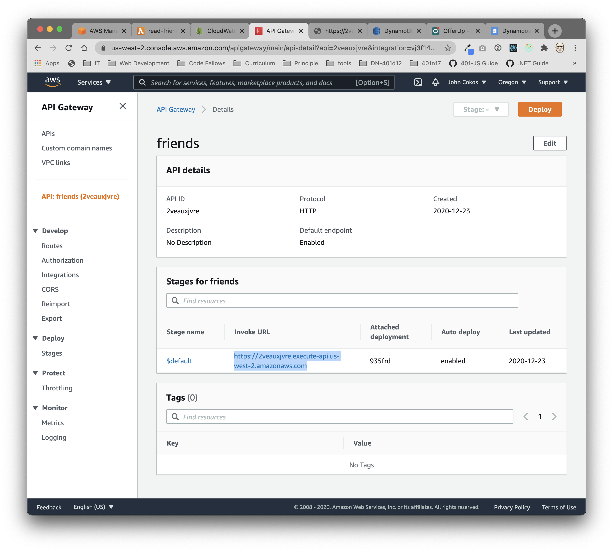
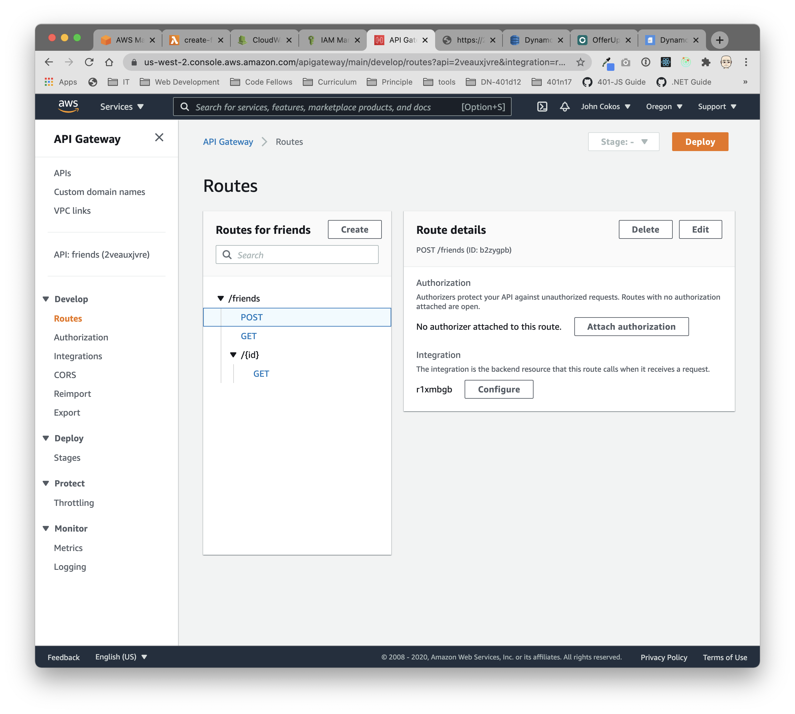

# Demos: AWS: API, Dynamo and Lambda

Use this document to describe the demo(s). Generally, this is going to take the format of either how to build the demo step by step, or less specifically, talking points surrounding the outcomes of the demo segment and code snippets to highlight.

## Demo 1: Demonstrate the process

- Create a simple GET route and connect it to your `adding` demo from the last class
- Prove that going to the route works in your browser, and shows you the right output
- Experiment with reading the Body, Query strings, and Route Parameters
  - `event.body`, `event.queryStringParameters`, `event.pathParameters`

## Demo 2: Create a Serverless API

> `/demo/lambdas`

Creating a serverless API: Checklist

- [ ] Define your resource (generally -- table name, fields, etc)
- [ ] Create API Endpoints for each REST method on your resource that point to the right lambda
- [ ] Create an IAM User role with full access to Lambda, API Gateway, and DynamoDB
- [ ] Create a new table at Dynamo
- [ ] Create Lambda function(s) that use Dynamoose to attach to the table
  - [ ] Create with the correct IAM Role (Step 1)
  - [ ] Create functions for each CRUD method, for each table
  - [ ] For demo, just do **CREATE** and **READ**, students will wire **PUT** and **DELETE** in lab

As you do your demo, you'll not want to simply code out the lambdas and upload them, there are some things that we'll want to make sure the students witness during the demo, with regards to how the API's work

### Create API Endpoints

1. At API Gateway, create a new HTTP API
1. Once created, define a route endpoint for each REST method
   - i.e. POST /people
1. Note that you can connect each endpoint to a lambda, but we've not yet created them ...

### Create the basic Lambda Functions to respond to the endpoints

Then, create 2 functions that you would want to run when certain API routes are invoked. Note that we provide in the demo: `create.js` and `read.js` to perform those basic methods.

> Our purpose in this early step is only to get the API gateway routes to connect to our functions and see how data is passed between them, not to wire in the database (yet)

Note in the functions, that we're using `event.body` as the POST data in the create function and `event.pathParameters` in the read function.  **Do not just code this out**

- Upload your function (do create first) and make sure it's properly setup
  - Correct IAM User
  - Correct handler

**How can we actually run this function?**

We need to connect it to an API route! Head back to the API Gateway find the POST route, and then click the "Add Integration" button to "connect" the route to your function. Like magic, when anyone does a POST to your endpoint, your function gets run.

Once you have that setup, test out the function, by POSTing to it using an HTTP REST client. You'll find the URL to the API on the API main page (you'll have to click out of the routes page to see it)

- You'll want to `console.log()` the event object to see what's in there.
- You need to go to cloudwatch to see this.
- When there, you'll "discover" that `event.body` has the data, but it's a string.
- So ... in your function, you'll need to `JSON.parse()` that to make create work.

> This is an excellent opportunity for students to see the full process and how all of AWS is connected. It's a lot of bouncing around between services, for sure. What works well is to have multiple browser windows open and tiled on your screen, so that students can see them all at the same time.

Repeat this process with the `read.js` function.

- First, wiring up the basic GET/read is easy.
  - Go to the dynamoose docs and find the `scan()` method which is how you get all records
  - While you're there, note how to query for one, by id
- Once you get that wired up, let's add support for `/:id` like we did in Express
  - In API Gateway, it's actually `/{id}`
  - Again, in the function, how can we find that `id` in the event?
  - Do the `console.log()` - cloudwatch log cycle again to find it
  - Then, you may integrate it into the code to find by id


### Great, but we have no data ... Create a Dynamo DB Table at AWS

1. Open the DynamoDB Dashboard
1. Choose `Create Table`
1. Name your table
1. Choose a field name to use as primary key
  - Generally, "id", and you'll need to supply this when you add records


### Connect your Lambda Functions to live data

When writing code that connects to a Dynamo Database, you'll need to know your AWS credentials and install `dynamoose` as a dependency. Note that at AWS, the credentials are wired in. If you run dynamoose code outside of AWS, you'll need to find those and set them as env vars.

<https://dynamoosejs.com/getting_started/Introduction>

Visit the docs with the students and review the similarities between Dynamoose and Mongoose or Sequelize

First, Create a Schema Module with Dynamoose

```javascript
'use strict';

const dynamoose = require('dynamoose');

const friendsSchema = new dynamoose.Schema({
  'id': String,
  'name': String,
  'phone': String,
});

module.exports = dynamoose.model('friends', friendsSchema);
```

Once you have your schema created, do the work of wiring in the queries into the lambda functions you already have, to see that you can get live data saving to the database


## Screenshots of the process

### IAM User Permissions



### Dynamo Table



### API




