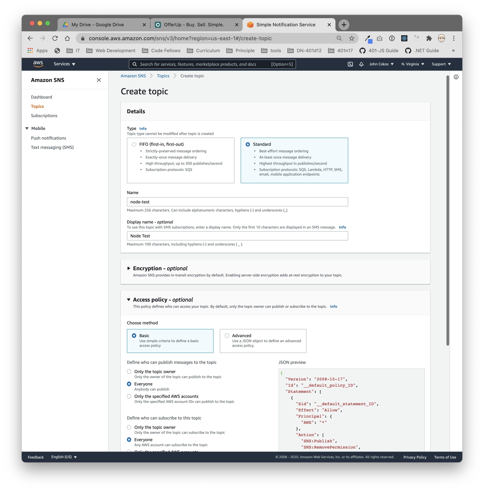
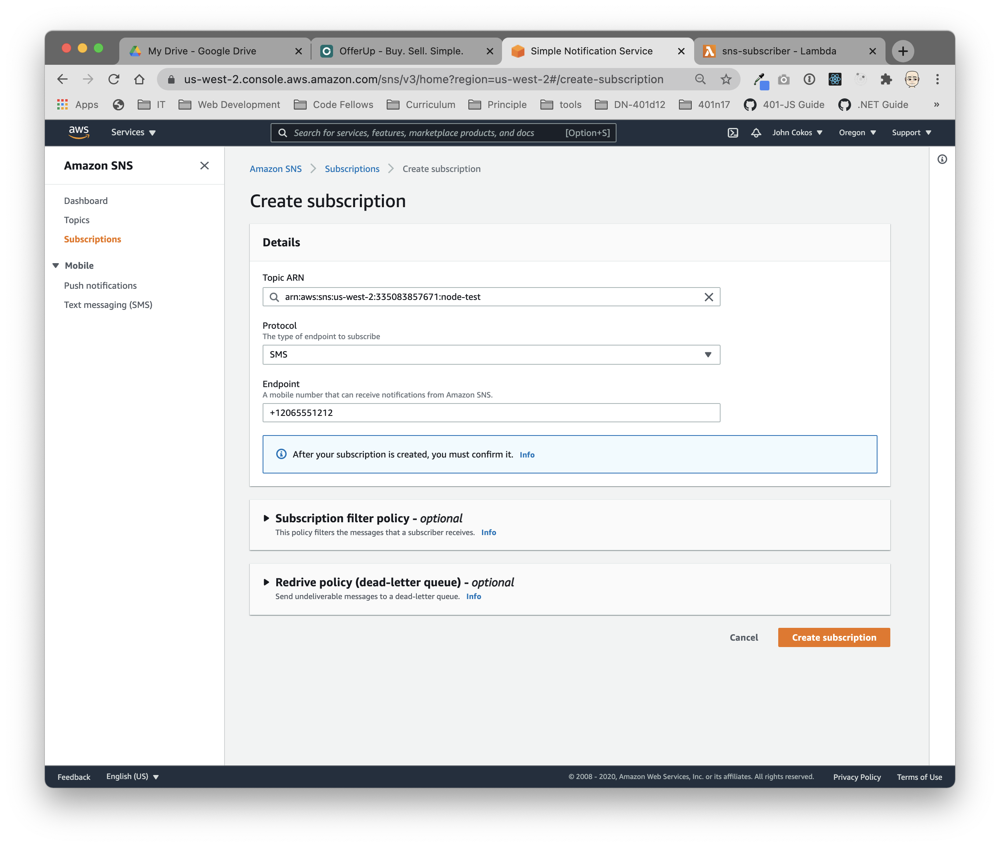
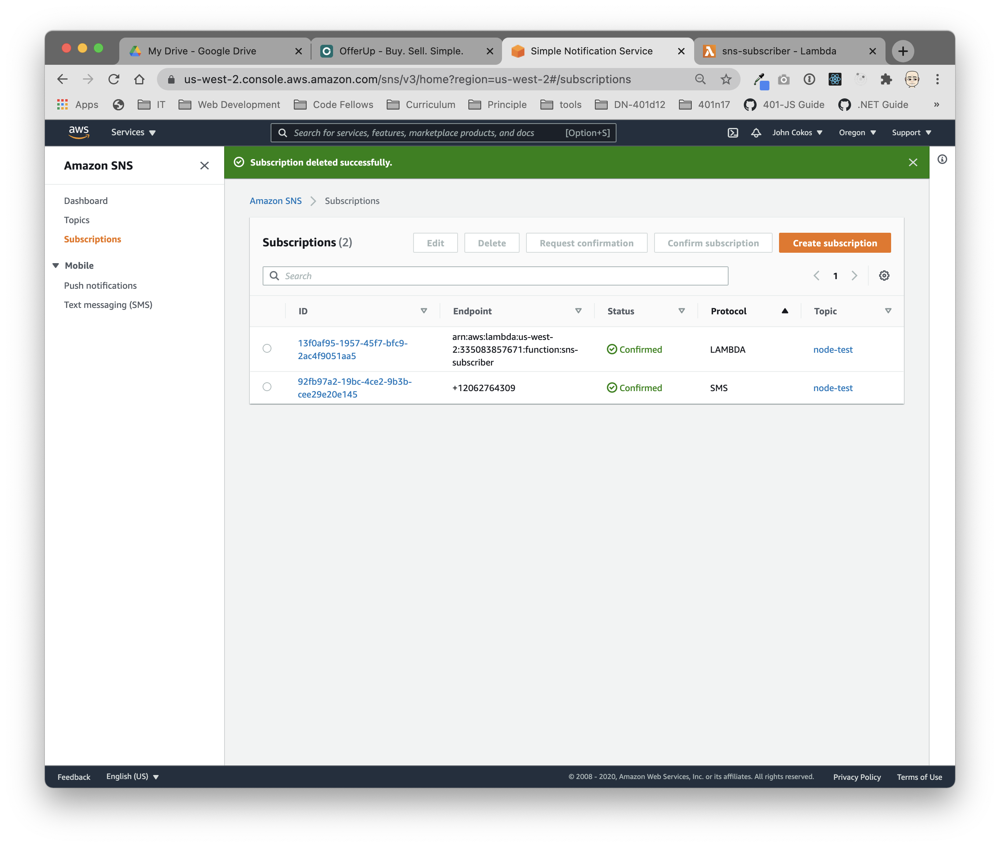
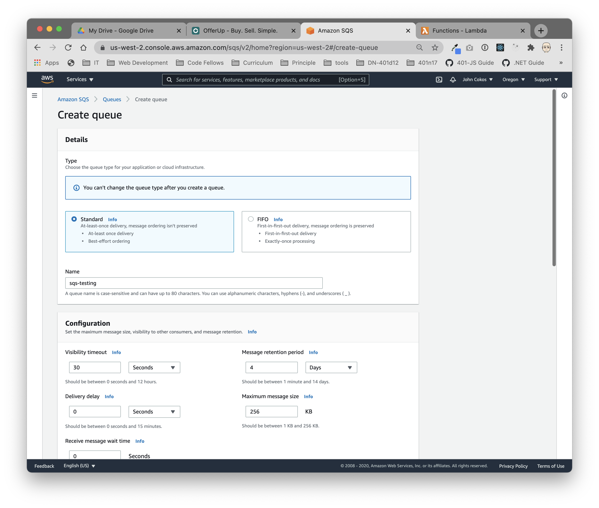

# Demos: AWS: Events

Use this document to describe the demo(s). Generally, this is going to take the format of either how to build the demo step by step, or less specifically, talking points surrounding the outcomes of the demo segment and code snippets to highlight.

## Demo 1: SNS

> `/demo/sns`

1. Create a new Topic in the AWS SNS Dashboard
   - Give it an obvious name like 'sns-testing'
   - Set it to allow anyone to publish, anyone to subscribe
1. Create a new subscriber to the topic
   - Choose SMS
   - Enter your phone number (i.e. +12065551212)
1. Create a simple node application that can publish to this topic
   - `/demo/sns/node/publish.js`
1. Run this application (`node publish.js`)
   - Your terminal will show you confirmation that the message was sent
   - Your cell phone should now have a text message that was pushed by SNS!

That's great, but each topic can have many subscribers (just like our socket hubs)

1. Create a lambda function, using the code in the `/demo/sns/lambda` folder.
1. Add a new subscriber to the topic.
   - Type: Lambda
   - Choose your new lambda function

Now, when you run the publisher again, you'll get a text AND that lambda function will be triggered.  Prove this by going to Cloudwatch and viewing the logs.

Certainly, this is a simplistic example, but it does showcase that you can trigger SNS from any application (node, another lambda, etc) and all subscribers will instantly get a push notification with the message as payload.

## Demo 2: SQS

> `./demo/sqs`

1. Create a new Queue in the AWS SQS Dashboard

- Give it an obvious name like 'sqs-testing'
- Choose the basic permissions setup
  - Note that for now, only the owner can publish or subscribe
  - You could open this up to other, outside applications

1. Write the 2 node applications (`publish.js`, `subscribe.js`)
   - Run the subscriber first, it'll sit there and wait
   - Then, run the publisher. It will fire hundreds of messages
   - Watch the subscriber try and keep up.
   - Notice that the messages are not FIFO (this can be changed)
   - Stop the subscriber, noting that there's probably hundreds of messages left
   - In fact, you can go to the SQS dashboard and click the "Messages" tab to see them
   - Re-start the subscriber and watch it consume the rest of the messages
   - This is a proper Queue!

This should look, feel, and act just like our CAPS application did. Now, let's switch gears and use SNS and SQS together.

1. Return to your Queue in the AWS Dashboard
1. Click the "Subscribe to SNS Topic" button
1. Choose the SNS topic you created before and save that selection
1. Now, on the command line, restart your `demos/sqs/subscribe.js` app
1. If you publish like you did before, it should work the same
1. Change, now, to the `/demo/sns/node` folder and run that publisher
   - You should get that text like you were getting before. And ...
   - Your subscriber should show the message as well

What happened?

You published to a topic. The topic did a push notification to all subscribers, including the queue.  The queue treats that like any incoming message and allows its subscribers to login and fetch them.

### How would you architect CAPS using this system?

## Screenshots

### SNS: Create Topic

### SNS: Create Subscription

### SNS: Subscribers

### SQS: Create Queue

