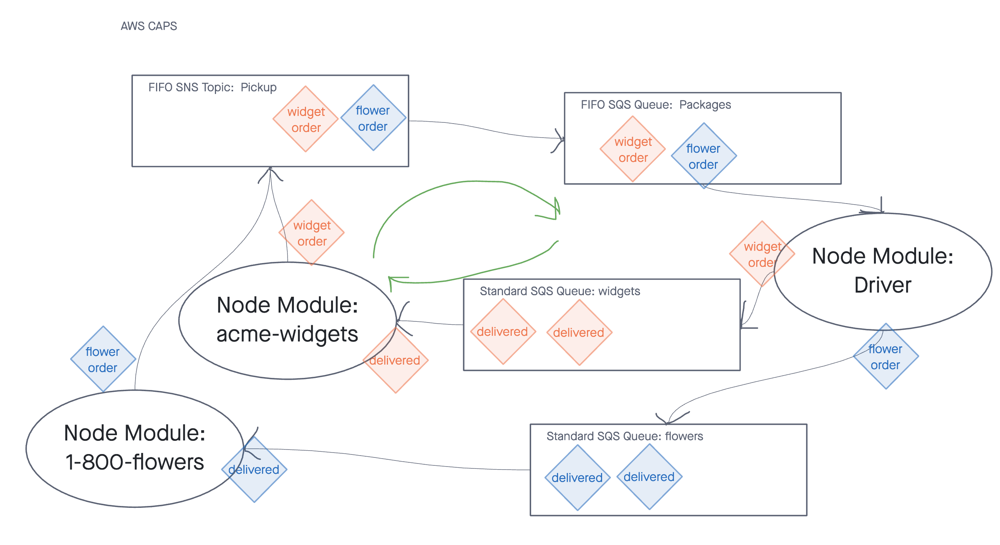

# Solution: AWS: Events

Notes:  
- no Lambda is necessary
- use chance to generate order details and uniques ids

### Permissions

- Ensure user has SNS Full Access
- Ensure user has SQS Full Access
- make subscription connection between SNS FIFO Topic pickup and SQS FIFO Queue
  - note: either can subscribe to the other in this case.  net result is the same

### Npm Packages 

- `aws-sdk`
- `sqs-consumer`
- `sqs-producer`
- `chance`
- `eslint`

### UML

## Grading Standards & Notes

* Deployment
* Features / Code Standards
